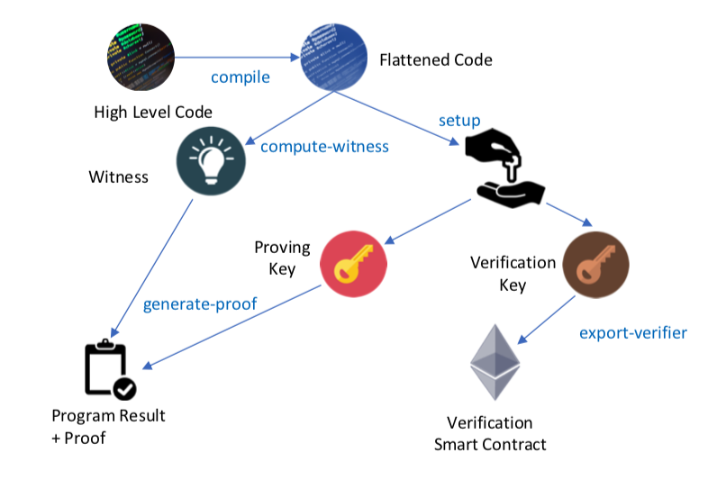
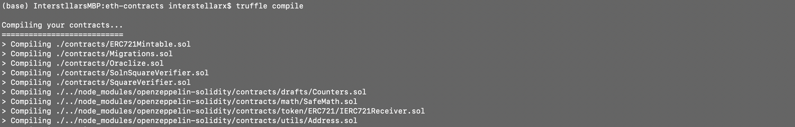

# 🏘 Decentralized Real Estate Marketplace

## Programming Libraries/Technologies Used:
- **Truffle v5.1.14-nodeLTS.0 (core: 5.1.13):** used in project to deploy, test, and deploy DApp's smart contracts.
- **Solidity v0.5.16 (solc-js):** an object-oriented, high-level langauge for writing, designing, and implementing smart contracts.
- **OpenZeppelin v2.1.2:** minimizes risk by using battle-tested libraries of smart contracts.
- **Ganache CLI v6.9.1 (ganache-core: 2.10.2):** used to create a local, test blockchain network.
- **Node v12.16.2:** used for easily building fast and scalable network applications - integral for deploying UI to the browswer.
- **Web3.js v1.2.1:** used to allow the DApp to interact with a local/remote Ethereum node with an HTTP, HTTPS, or IPC connection.

## Token Information:
- Name: IntREstellarToken
- Token Address: [0xf7759A5A0161F1B2bEF56B7fFDc7F134bAE8afA1](https://rinkeby.etherscan.io/address/0x373BD46cb1396ff6525526176b5402EBdD3D507e)
- [OpenSea Storefront Link](https://rinkeby.opensea.io/assets/intrestellar-real-estate-marketplace)

## Contracts Used for Project:
[ERC721Mintable.sol](./eth-contracts/contracts/ERC721Mintable.sol)
[SoInSquareVerifier.sol](eth-contracts/contracts/SolnSquareVerifier.sol)
[SquareVerifier.sol](eth-contracts/contracts/SquareVerifier.sol)

## Proof of Deployment
### Part 1: 
        Starting migrations...
        ======================
        > Network name:    'rinkeby'
        > Network id:      4
        > Block gas limit: 0x989680

        1_initial_migration.js
        ======================

        Deploying 'Migrations'
        ----------------------
        > transaction hash:    0x9938d59e6441a771853255b208eda93872223c08ad7d61f535501d44c1433c49
        > Blocks: 0            Seconds: 12
        > contract address:    0xaB972FfbB64200EA93a1db9836329063cb67B8D6
        > block number:        6749265
        > block timestamp:     1593394449
        > account:             0x627306090abaB3A6e1400e9345bC60c78a8BEf57
        > balance:             0.567475211
        > gas used:            243328
        > gas price:           10 gwei
        > value sent:          0 ETH
        > total cost:          0.00243328 ETH

        > Saving migration to chain.
        > Saving artifacts
        -------------------------------------
        > Total cost:          0.00243328 ETH

        2_deploy_contracts.js
        =====================

        Deploying 'Verifier'
        --------------------
        > transaction hash:    0x6545dc40b2157cde51641923e882f6e05d2194290b238b4413b4da22af4b1021
        > Blocks: 1            Seconds: 12
        > contract address:    0xe64541383901a77B280BE31105137E4cdf4D3e62
        > block number:        6749267
        > block timestamp:     1593394479
        > account:             0x627306090abaB3A6e1400e9345bC60c78a8BEf57
        > balance:             0.556617181
        > gas used:            1043435
        > gas price:           10 gwei
        > value sent:          0 ETH
        > total cost:          0.01043435 ETH

        Deploying 'SolnSquareVerifier'
        ------------------------------
        > transaction hash:    0x83211520e46b52b36d7ae55181e2d1f3ec442eac5b5dbc156b1c0c1bdbbd8a59
        > Blocks: 1            Seconds: 12
        > contract address:    0xf7759A5A0161F1B2bEF56B7fFDc7F134bAE8afA1
        > block number:        6749268
        > block timestamp:     1593394494
        > account:             0x627306090abaB3A6e1400e9345bC60c78a8BEf57
        > balance:             0.523429311
        > gas used:            3318787
        > gas price:           10 gwei
        > value sent:          0 ETH
        > total cost:          0.03318787 ETH

        > Saving migration to chain.
        > Saving artifacts
        -------------------------------------
        > Total cost:          0.04362222 ETH

        Summary
        =======
        > Total deployments:   3
        > Final cost:          0.0460555 ETH

### Part 2:
        Starting migrations...
        ======================
        > Network name:    'rinkeby'
        > Network id:      4
        > Block gas limit: 0x989680

        1_initial_migration.js
        ======================

        Replacing 'Migrations'
        ----------------------
        > transaction hash:    0xc62cc9017c1a4a6c3e49ccef63a89502239e7e3959d8a2e851d7fc7fca2310ca
        > Blocks: 0            Seconds: 4
        > contract address:    0x242d8C5ff132B65A242146A3961683cCB394457D
        > block number:        6749288
        > block timestamp:     1593394794
        > account:             0x627306090abaB3A6e1400e9345bC60c78a8BEf57
        > balance:             0.520722351
        > gas used:            243328
        > gas price:           10 gwei
        > value sent:          0 ETH
        > total cost:          0.00243328 ETH

        > Saving migration to chain.
        > Saving artifacts
        -------------------------------------
        > Total cost:          0.00243328 ETH

        2_deploy_contracts.js
        =====================

        Replacing 'Verifier'
        --------------------
        > transaction hash:    0xdf3c82467c2e6278344f10dd6277960d9eb4d021a0093593de027d796911def1
        > Blocks: 1            Seconds: 12
        > contract address:    0x905c9aE37F1b9bE89D6E013AD454D7c01682FEB8
        > block number:        6749290
        > block timestamp:     1593394824
        > account:             0x627306090abaB3A6e1400e9345bC60c78a8BEf57
        > balance:             0.509864321
        > gas used:            1043435
        > gas price:           10 gwei
        > value sent:          0 ETH
        > total cost:          0.01043435 ETH

        Replacing 'SolnSquareVerifier'
        ------------------------------
        > transaction hash:    0x4feddce9172efd632f582ff578770de36331c1b42a7d4fc3f680b7d173cd9d4b
        > Blocks: 0            Seconds: 12
        > contract address:    0xAcED29b0AcB5EeF4A985096AF9EDE058d2a0b886
        > block number:        6749291
        > block timestamp:     1593394839
        > account:             0x627306090abaB3A6e1400e9345bC60c78a8BEf57
        > balance:             0.476676451
        > gas used:            3318787
        > gas price:           10 gwei
        > value sent:          0 ETH
        > total cost:          0.03318787 ETH

        > Saving migration to chain.
        > Saving artifacts
        -------------------------------------
        > Total cost:          0.04362222 ETH

        Summary
        =======
        > Total deployments:   3
        > Final cost:          0.0460555 ETH

## ABI
    [
        {
        "constant": true,
        "inputs": [
            {
            "name": "interfaceId",
            "type": "bytes4"
            }
        ],
        "name": "supportsInterface",
        "outputs": [
            {
            "name": "",
            "type": "bool"
            }
        ],
        "payable": false,
        "stateMutability": "view",
        "type": "function"
        },
        {
        "constant": true,
        "inputs": [],
        "name": "name",
        "outputs": [
            {
            "name": "",
            "type": "string"
            }
        ],
        "payable": false,
        "stateMutability": "view",
        "type": "function"
        },
        {
        "constant": true,
        "inputs": [
            {
            "name": "tokenId",
            "type": "uint256"
            }
        ],
        "name": "getApproved",
        "outputs": [
            {
            "name": "",
            "type": "address"
            }
        ],
        "payable": false,
        "stateMutability": "view",
        "type": "function"
        },
        {
        "constant": false,
        "inputs": [
            {
            "name": "to",
            "type": "address"
            },
            {
            "name": "tokenId",
            "type": "uint256"
            }
        ],
        "name": "approve",
        "outputs": [],
        "payable": false,
        "stateMutability": "nonpayable",
        "type": "function"
        },
        {
        "constant": true,
        "inputs": [],
        "name": "totalSupply",
        "outputs": [
            {
            "name": "",
            "type": "uint256"
            }
        ],
        "payable": false,
        "stateMutability": "view",
        "type": "function"
        },
        {
        "constant": false,
        "inputs": [
            {
            "name": "from",
            "type": "address"
            },
            {
            "name": "to",
            "type": "address"
            },
            {
            "name": "tokenId",
            "type": "uint256"
            }
        ],
        "name": "transferFrom",
        "outputs": [],
        "payable": false,
        "stateMutability": "nonpayable",
        "type": "function"
        },
        {
        "constant": false,
        "inputs": [
            {
            "name": "_myid",
            "type": "bytes32"
            },
            {
            "name": "_result",
            "type": "string"
            }
        ],
        "name": "__callback",
        "outputs": [],
        "payable": false,
        "stateMutability": "nonpayable",
        "type": "function"
        },
        {
        "constant": true,
        "inputs": [
            {
            "name": "owner",
            "type": "address"
            },
            {
            "name": "index",
            "type": "uint256"
            }
        ],
        "name": "tokenOfOwnerByIndex",
        "outputs": [
            {
            "name": "",
            "type": "uint256"
            }
        ],
        "payable": false,
        "stateMutability": "view",
        "type": "function"
        },
        {
        "constant": false,
        "inputs": [
            {
            "name": "_myid",
            "type": "bytes32"
            },
            {
            "name": "_result",
            "type": "string"
            },
            {
            "name": "_proof",
            "type": "bytes"
            }
        ],
        "name": "__callback",
        "outputs": [],
        "payable": false,
        "stateMutability": "nonpayable",
        "type": "function"
        },
        {
        "constant": false,
        "inputs": [],
        "name": "unpause",
        "outputs": [],
        "payable": false,
        "stateMutability": "nonpayable",
        "type": "function"
        },
        {
        "constant": false,
        "inputs": [
            {
            "name": "from",
            "type": "address"
            },
            {
            "name": "to",
            "type": "address"
            },
            {
            "name": "tokenId",
            "type": "uint256"
            }
        ],
        "name": "safeTransferFrom",
        "outputs": [],
        "payable": false,
        "stateMutability": "nonpayable",
        "type": "function"
        },
        {
        "constant": true,
        "inputs": [
            {
            "name": "index",
            "type": "uint256"
            }
        ],
        "name": "tokenByIndex",
        "outputs": [
            {
            "name": "",
            "type": "uint256"
            }
        ],
        "payable": false,
        "stateMutability": "view",
        "type": "function"
        },
        {
        "constant": true,
        "inputs": [
            {
            "name": "tokenId",
            "type": "uint256"
            }
        ],
        "name": "ownerOf",
        "outputs": [
            {
            "name": "",
            "type": "address"
            }
        ],
        "payable": false,
        "stateMutability": "view",
        "type": "function"
        },
        {
        "constant": true,
        "inputs": [
            {
            "name": "owner",
            "type": "address"
            }
        ],
        "name": "balanceOf",
        "outputs": [
            {
            "name": "",
            "type": "uint256"
            }
        ],
        "payable": false,
        "stateMutability": "view",
        "type": "function"
        },
        {
        "constant": false,
        "inputs": [],
        "name": "pause",
        "outputs": [],
        "payable": false,
        "stateMutability": "nonpayable",
        "type": "function"
        },
        {
        "constant": true,
        "inputs": [],
        "name": "symbol",
        "outputs": [
            {
            "name": "",
            "type": "string"
            }
        ],
        "payable": false,
        "stateMutability": "view",
        "type": "function"
        },
        {
        "constant": false,
        "inputs": [
            {
            "name": "to",
            "type": "address"
            },
            {
            "name": "approved",
            "type": "bool"
            }
        ],
        "name": "setApprovalForAll",
        "outputs": [],
        "payable": false,
        "stateMutability": "nonpayable",
        "type": "function"
        },
        {
        "constant": true,
        "inputs": [],
        "name": "_owner",
        "outputs": [
            {
            "name": "",
            "type": "address"
            }
        ],
        "payable": false,
        "stateMutability": "view",
        "type": "function"
        },
        {
        "constant": false,
        "inputs": [
            {
            "name": "from",
            "type": "address"
            },
            {
            "name": "to",
            "type": "address"
            },
            {
            "name": "tokenId",
            "type": "uint256"
            },
            {
            "name": "_data",
            "type": "bytes"
            }
        ],
        "name": "safeTransferFrom",
        "outputs": [],
        "payable": false,
        "stateMutability": "nonpayable",
        "type": "function"
        },
        {
        "constant": true,
        "inputs": [
            {
            "name": "tokenId",
            "type": "uint256"
            }
        ],
        "name": "tokenURI",
        "outputs": [
            {
            "name": "",
            "type": "string"
            }
        ],
        "payable": false,
        "stateMutability": "view",
        "type": "function"
        },
        {
        "constant": true,
        "inputs": [],
        "name": "baseTokenURI",
        "outputs": [
            {
            "name": "",
            "type": "string"
            }
        ],
        "payable": false,
        "stateMutability": "view",
        "type": "function"
        },
        {
        "constant": true,
        "inputs": [
            {
            "name": "owner",
            "type": "address"
            },
            {
            "name": "operator",
            "type": "address"
            }
        ],
        "name": "isApprovedForAll",
        "outputs": [
            {
            "name": "",
            "type": "bool"
            }
        ],
        "payable": false,
        "stateMutability": "view",
        "type": "function"
        },
        {
        "constant": false,
        "inputs": [
            {
            "name": "newOwner",
            "type": "address"
            }
        ],
        "name": "transferOwnership",
        "outputs": [],
        "payable": false,
        "stateMutability": "nonpayable",
        "type": "function"
        },
        {
        "anonymous": false,
        "inputs": [
            {
            "indexed": true,
            "name": "from",
            "type": "address"
            },
            {
            "indexed": true,
            "name": "to",
            "type": "address"
            },
            {
            "indexed": true,
            "name": "tokenId",
            "type": "uint256"
            }
        ],
        "name": "Transfer",
        "type": "event"
        },
        {
        "anonymous": false,
        "inputs": [
            {
            "indexed": true,
            "name": "owner",
            "type": "address"
            },
            {
            "indexed": true,
            "name": "approved",
            "type": "address"
            },
            {
            "indexed": true,
            "name": "tokenId",
            "type": "uint256"
            }
        ],
        "name": "Approval",
        "type": "event"
        },
        {
        "anonymous": false,
        "inputs": [
            {
            "indexed": true,
            "name": "owner",
            "type": "address"
            },
            {
            "indexed": true,
            "name": "operator",
            "type": "address"
            },
            {
            "indexed": false,
            "name": "approved",
            "type": "bool"
            }
        ],
        "name": "ApprovalForAll",
        "type": "event"
        },
        {
        "anonymous": false,
        "inputs": [
            {
            "indexed": false,
            "name": "sender",
            "type": "address"
            }
        ],
        "name": "Paused",
        "type": "event"
        },
        {
        "anonymous": false,
        "inputs": [
            {
            "indexed": false,
            "name": "sender",
            "type": "address"
            }
        ],
        "name": "Unpaused",
        "type": "event"
        },
        {
        "anonymous": false,
        "inputs": [
            {
            "indexed": true,
            "name": "oldOwner",
            "type": "address"
            },
            {
            "indexed": true,
            "name": "newOwner",
            "type": "address"
            }
        ],
        "name": "OwnershipTransfered",
        "type": "event"
        },
        {
        "constant": false,
        "inputs": [
            {
            "name": "to",
            "type": "address"
            },
            {
            "name": "tokenId",
            "type": "uint256"
            }
        ],
        "name": "mint",
        "outputs": [
            {
            "name": "",
            "type": "bool"
            }
        ],
        "payable": false,
        "stateMutability": "nonpayable",
        "type": "function"
        }
    ]

# Process
- Install with: 
`npm install`
- Get truffle set up with:
`truffle compile`
- Install [Docker](https://docs.docker.com/install/)
- Run ZoKrates docker container
- 
- Implement the ZoKrates framework with the five step process:
    ## 1. Compile program
    **Get to Docker**
    `docker run -v /.../.../.../.../Real-Estate-Marketplace:/home/zokrates/code -ti zokrates/zokrates /bin/bash`
    **Get to the square.code file** (ended up using ls to go through it manually)
    `ls --> cd code --> ls --> cd zokrates --> cd code --> cd square`
    Overall, you're going to: ~/code/zokrates/code/square
    **Compile the `smart.code` file:
    `~/code/zokrates/code/szokrates@XXXXXXXXXX:~/code/zokrates/code/szokrates@XXXXXXXXXX:~/cozokrates@6XXXXXXXXXX:~/code/zokrazokrates@XXXXXXXXXX:~/code/zokrateszokrates@zokrzozokrates@XXXXXXXXXX:~/code/zokrates/code/square$ ~/zokrates compile -i square.code`
    
    ## 2. Trusted setup
    Run: `~/zokrates setup`

    ## 3. Compute-Witness
    Run: `~/code/zokrates/code/square$ ~/zokrates compute-witness -a 3 9`

    ## 4. Generate-Proof
    Run: `~/zokrates generate-proof`

    ## 5. Export-Verifier
    Run: `~/zokrates export-verifier`

## Testing Procedures
- Run Ganache-CLI in terminal window #1:
`ganache-cli -m "seed phrase"`
- Run Truffle Tests in terminal window #2 to assess the usability of the Solidity Smart Contracts:
     - Test #1: Square Verifier 
     `truffle test ./test/TestSquareVerifier.js`
     - Test #2: Soln Square Verifier
     `truffle test ./test/TestSolnSquareVerifier.js`
     - Test #3: ERC-721 Mintable
     `truffle test ./test/TestERC721Mintable.js`

## Rinkeby Setup
- update `truffle-config.js` with what Infura settings are
- run the following command in another terminal window:
`truffle migrate --network rinkeby`
- to deploy: `truffle migrate --network rinkeby --reset`

## Preface
At present, property titles are often paper-based, creating opportunities for errors and fraud. Title professionals find defects in 25% of all titles during the transaction process, according to the American Land Title Association. Any identified defect makes it illegal to transfer a property title to a buyer until it is rectified. This means property owners often incur high legal fees to ensure authenticity and accuracy of their property titles. Moreover, title fraud poses a risk to homeowners worldwide. US losses associated with title fraud reportedly averaged around $103,000 per case in 2015, compelling many property buyers to purchase title insurance. These title management issues could potentially be mitigated by using blockchain technology to build immutable digital records of land titles and using blockchain for transparent transactions. This approach could simplify property title management, making it more transparent and helping to reduce the risk of title fraud and the need for additional insurance.

Some companies and governments around the globe have already implemented blockchain technology for the title management process. Ghanaian blockchain company Bitland has been working on a solution for Ghana, where it is estimated that almost 80% of land is unregistered, according to Forbes. Those that possess unregistered land find it more difficult to prove legal ownership, increasing their exposure to the risk of land seizures or property theft. Bitland is seeking to create secure digital public records of ownership on its blockchain platform, with the aim of protecting land owners from title fraud. Bitland has expanded to operate in 7 African nations, India, and is also working with Native Americans in the US.

## Project Scope
This project involves minting a token to represent the title to the properties, first by verifying ownership of the property on the blockchain and then using zk-SNARKs to create a verification system for proving ownership of the title to the property without revealing that specific information on the property. After verification, it is placed on a blockchain market place (OpenSea) for others to purchase. 

# Project Resources

## Links
* [Remix - Solidity IDE](https://remix.ethereum.org/)
* [Visual Studio Code](https://code.visualstudio.com/)
* [Truffle Framework](https://truffleframework.com/)
* [Ganache - One Click Blockchain](https://truffleframework.com/ganache)
* [Open Zeppelin ](https://openzeppelin.org/)
* [Interactive zero knowledge 3-colorability demonstration](http://web.mit.edu/~ezyang/Public/graph/svg.html)
* [Docker](https://docs.docker.com/install/)
* [ZoKrates](https://github.com/Zokrates/ZoKrates)
* [OpenSea](https://docs.opensea.io/docs)

## OpenSea
OpenSea is a decentralized marketplace that is used for selling for crypto assets such as CryptoKitties and other digital assets that are powered off Ethereum. On OpenSea, you can buy or sell any of these items through a smart contract, meaning that no central authority ever holds custody of your items. You can even check out the source code for this smart contract [here](https://etherscan.io/address/0x7be8076f4ea4a4ad08075c2508e481d6c946d12b). Check out the documentation [here](https://docs.opensea.io/docs).

OpenSea is used in this project to list the property tokens for sale. In order to list a property, you'll need to go to the item on your account page. On the item detail page, click "Sell". This will walk you through the steps for selling an item. Note that the first time you auction an item, you will need to complete several MetaMask transactions in order to give the exchange contracts access to your items. After you complete these initial steps, creating an auction will only require signing a MetaMask message. This means that you can auction items without paying gas.

## ZoKrates
Succinct Zero-Knowledge proofs (zkSnarks) are proving to be one of the most promising frameworks for enhancing privacy and scalability in the blockchain space. Projects like Zcash are using zkSnarks to make payments anonymous (rather than pseudonymous). Other projects such as Coda are experimenting with trustless light clients by using recursive zkSnarks to dramatically reduce the number of state verifications blockchain clients have to perform when coming online. Ethereum founder, [Vitalik Buterin wrote how zkSnarks can be used to scale transaction speed on Ethereum](https://ethresear.ch/t/on-chain-scaling-to-potentially-500-tx-sec-through-mass-tx-validation/3477).

This project leverages ZoKrates, a toolbox for zkSNARKS on Ethereum, to implement zkSnarks for the decentralized real estate marketplace. Traditionally, snarks are written using NP complete arithmetic circuits which can be compared to writing assembly code in traditional machine programming. ZoKrates provides a higher level programming language (something like C in the same metaphor) which compiles down to the underlying constraint system and thus allows programmers to write snarks much closer to how they are used to programming.

# Screenshots of Generating Zero-Knowledge Proofs with Zokrates

## 1. Compile program
 
 
## 2. Trusted setup
 

## 3. Compute-Witness
 

## 4. Generate-Proof
 

## 5. Export-Verifier
 

# Screenshots of Smart Contracts Compiling Successfully
 
 

# Storefront on OpenSea

